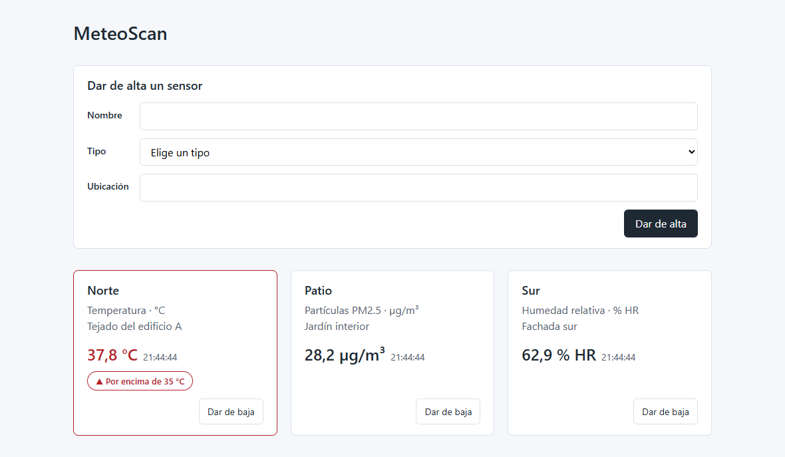

# MeteoScan

[](https://github.com/Beastofdev/meteoscan/actions/workflows/checks.yml)

Panel de monitorización de sensores —un mini SCADA web—. Una red simulada de
sensores de temperatura, humedad y calidad del aire envía lecturas cada pocos
segundos; el panel las lista, dibuja su evolución y avisa en rojo cuando un
valor pasa del umbral de su tipo.



## Qué hace

```
 simulador ──POST /lecturas──►  API  ──►  PostgreSQL
                                 ▲
     panel ───────GET────────────┘   (cada 5 s)
```

- **El simulador** hace de red de sensores: cada cinco segundos manda una
  lectura de cada sensor en servicio **por la misma API** que usaría un sensor
  de verdad, con valores que se mueven poco a poco dentro del rango de su tipo.
- **La API** comprueba cada entrada antes de tocar la base, y la base vuelve a
  comprobarlo todo debajo.
- **El panel** lista los sensores con su último valor, da de alta y de baja,
  dibuja el histórico de cada uno y marca en rojo el que pasa de su umbral. Se
  pone al día solo cada cinco segundos.

Los umbrales viven en el tipo de sensor: **35 °C** y **35 µg/m³** de PM2.5, cada
uno con su fuente en la
[0017](docs/decisiones/0017-los-umbrales-de-alerta.md); la humedad no tiene,
porque al aire libre no hay un límite que citar.

## Stack

| | |
|---|---|
| API | Node.js 24 y Express 5 |
| Base de datos | PostgreSQL 18, en Docker |
| Panel | React 19 con Vite, React Router y recharts |
| Pruebas | `node --test` y SQL, sin librerías de pruebas |
| Integración continua | GitHub Actions |

## Cómo arrancarlo

Hacen falta **Docker** y **Node 24**. Una vez por clon, el `.env` a partir de su
plantilla, con una contraseña de letras y números:

```
cp .env.example .env
```

Después, cada cosa en su terminal:

```
# 1. la base de datos, en el 5438
docker compose up -d

# 2. el esquema, la primera vez. OJO: vacía las tablas
docker compose exec -T db psql -U meteoscan -v ON_ERROR_STOP=1 < db/schema.sql

# 3. la API, en el 8005
cd backend && npm install && npm run dev

# 4. el panel, en el 5177
cd frontend && npm install && npm run dev

# 5. el simulador: sin él, los sensores no tienen lecturas
cd backend && npm run simular
```

Y el panel queda en <http://localhost:5177>.

Detalles que conviene saber:

- **En PowerShell**, la orden del esquema se escribe de otra forma, porque no
  tiene `<`: está en [`db/README.md`](db/README.md).
- **`npm run dev`** reinicia la API sola al guardar un cambio; `npm start` la
  arranca sin más. Si falta alguna variable del `.env`, no arranca y dice cuál.
- **El panel llama a la API por `/api`**, y su servidor de desarrollo reenvía
  esas peticiones al 8005 quitando el prefijo: no hay nada más que configurar
  ([0016](docs/decisiones/0016-el-detalle-de-un-sensor.md)).
- **El ritmo del simulador** se cambia con `SIM_INTERVAL_MS`, y la dirección de
  la API, con `API_URL`.

## La API

| Ruta | Qué hace |
|---|---|
| `GET /sensores` | Los sensores en servicio, con la unidad y el umbral de su tipo, y su última lectura |
| `POST /sensores` | Da de alta un sensor: `name`, `sensor_type` y `location` |
| `DELETE /sensores/:id` | Lo da de baja: desaparece de la lista y deja de aceptar lecturas; las que tiene se conservan |
| `GET /sensores/:id/lecturas` | Su histórico: las últimas 1000, de la más antigua a la más nueva |
| `POST /lecturas` | Guarda una lectura: `sensor_id`, `value` y `recorded_at` en RFC 3339, con zona horaria |
| `GET /health` | `{"status":"ok","database":"ok"}` si la API está viva y llega a la base; `503` si no llega |

Los errores viajan en JSON, con un **código estable** para los programas y un
mensaje para las personas
([0009](docs/decisiones/0009-los-errores-de-la-api.md)).

## Cómo está organizado

```
db/                  el esquema y sus pruebas
backend/             la API con Express y el simulador
frontend/            el panel con React
docs/                los requisitos, las decisiones y lo aparcado
compose.yaml         la base de datos de desarrollo, en Docker
.env.example         las variables que hay que copiar a .env
CONTRIBUTING.md      las normas del proyecto
check.sh             la única lista de comprobaciones
.githooks/pre-push   las corre antes de cada push
.github/workflows/   las corre en GitHub, en cada push
```

## Cómo se comprueba

```
bash check.sh
```

Cuatro comprobaciones: **la documentación** (enlaces y decisiones), **los tipos
del panel** (que son los mismos que los de la base), **el esquema** (42 pruebas)
y **la API** (25 pruebas).

Las dos últimas necesitan **Docker en marcha**: corren sobre un PostgreSQL de
usar y tirar que se crea y se destruye en cada pasada, nunca sobre la base de
desarrollo
([0004](docs/decisiones/0004-toda-comprobacion-sobre-entorno-limpio.md)). Las de
la API necesitan además las dependencias de `backend/` instaladas y **el puerto
8005 libre**, así que la API de desarrollo tiene que estar parada mientras
corren ([0011](docs/decisiones/0011-las-pruebas-de-la-api.md)).

La misma lista corre **antes de cada push** y **en GitHub**, en cada push y en
cada pull request
([0005](docs/decisiones/0005-comprobaciones-en-local-y-en-ci.md)). Para que el
hook se dispare, una vez por clon:

```
git config core.hooksPath .githooks
```

## Lo que queda fuera, a propósito

Migraciones en lugar de recrear el esquema, pedir un tramo concreto del
histórico, los límites de lo plausible de cada tipo de sensor, las lecturas
medidas «en el futuro» y rechazar un cuerpo que no sea UTF-8 válido. Cada una
está en [`docs/pendiente.md`](docs/pendiente.md) con **el momento en que se
retoma y el motivo de la espera**.

## Por qué es así

Cada decisión que alguien podría querer deshacer sin saber lo que costó está en
[`docs/decisiones/`](docs/decisiones/README.md), con las alternativas que se
descartaron: el diseño de la base, los errores de la API, el proxy del panel,
los umbrales y su fuente, y cómo se comprueba todo.

Las normas del repositorio —el esquema, la API, los commits, el idioma— están en
[`CONTRIBUTING.md`](CONTRIBUTING.md).

## Licencia

MIT: se puede usar, copiar y modificar, citando al autor y sin garantía. El
texto, en [`LICENSE`](LICENSE).
